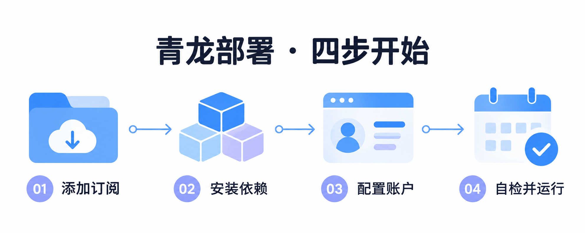
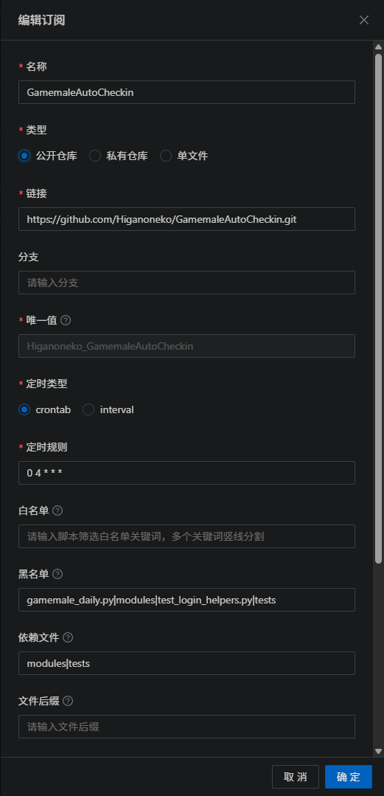

# GameMale Auto Check-in

让 [GameMale 论坛](https://www.gamemale.com) 的签到、抽奖、任务接取与领奖每天自动运行，并查看资产变化和升级所需积分。

准备好一个论坛账户、完整 Cookie，以及 **Python 3.10+** 的运行环境。推荐使用青龙面板，也可以在本地或 GitHub Actions 运行。

| 你想怎么运行 | 从这里开始 |
| --- | --- |
| 已有青龙面板，每天定时签到 | [青龙面板部署](#青龙面板部署) |
| 先在自己的电脑上试用 | [本地运行](#本地运行) |
| 使用 GitHub 定时运行 | [GitHub Actions](#github-actions) |
| 已完成部署，想调整任务 | [常用配置](#常用配置) · [运行命令](#运行命令) |
| 遇到登录、依赖或验证问题 | [常见问题](#常见问题) |

## 青龙面板部署



### 1. 添加订阅

进入 **订阅管理 → 新建订阅**，按下表填写，保存后手动运行订阅一次。

| 字段 | 填写内容 | 怎么用 |
| --- | --- | --- |
| 名称 | `GamemaleAutoCheckin` | 自定义一个容易识别的名称 |
| 类型 | **公开仓库** | 拉取完整仓库，保留入口与依赖目录 |
| 链接 | `https://github.com/Higanoneko/GamemaleAutoCheckin.git` | 项目地址 |
| 分支 | `main`，也可按截图留空 | 留空使用仓库默认分支 |
| 唯一值 | 保留自动生成的值 | 截图为 `Higanoneko_GamemaleAutoCheckin`，用于区分订阅 |
| 定时类型 | `crontab` | 按 Cron 表达式更新订阅 |
| 定时规则 | `0 4 * * *` | 每天 04:00 更新脚本，以面板时区为准；签到时间另设 |
| 白名单 | **留空** | 按截图不额外限制，配合下方黑名单筛选 |
| 黑名单 | `gamemale_daily.py\|modules\|test_login_helpers.py\|tests` | 排除普通入口、模块和测试文件，避免当成签到任务导入 |
| 依赖文件 | `modules\|tests` | 按截图复制目录；日常运行必需的是 `modules`，`tests` 可保留作离线检查 |
| 文件后缀 | **留空** | 按截图使用面板默认后缀筛选 |

**黑白名单与依赖文件怎么搭配？** 多个关键词用竖线 `|` 分隔，不是逗号。

| 字段 | 作用 | 示例与结果 |
| --- | --- | --- |
| 白名单 | 只选择路径匹配的脚本 | 填 `gamemale_daily_ql`，只选择青龙入口；留空则不做这层限制 |
| 黑名单 | 从候选脚本中排除匹配项 | 填 `gamemale_daily.py\|modules\|test_login_helpers.py\|tests`，保留青龙入口，排除普通入口及辅助文件 |
| 依赖文件 | 把所需文件或目录复制到脚本目录，不受黑名单影响 | `modules\|tests` 让这些目录可被使用，同时不作为日常任务导入 |

`modules` 同时出现在黑名单和依赖文件中是正常配置：它需要被复制供入口导入，但不需要单独执行。这里的关键词用于筛选仓库文件，和下文排除论坛任务的 `task_exclude_*` 无关。筛选规则见[青龙官方说明](https://qinglong.online/guide/user-guide/basic-explanation)。

<details>
<summary>查看订阅填写截图</summary>

<p></p>

</details>

订阅完成后，到 **定时任务** 搜索 `GameMale 自动签到`，确认执行入口是 **`gamemale_daily_ql.py`**。如果以前已导入普通入口或测试任务，禁用或删除这些旧任务，避免重复运行。

### 2. 安装 Python 依赖

进入 **依赖管理 → Python3 → 新建依赖**，安装以下三项，等待安装完成。

| 依赖 | 填写值 | 什么时候需要 |
| --- | --- | --- |
| HTTP 请求 | `requests==2.34.2` | 必需 |
| 页面解析 | `beautifulsoup4==4.15.0` | 必需 |
| YAML 配置 | `PyYAML==6.0.3` | 必需 |
| 图片验证码识别 | `ddddocr==1.6.1` | 只有密码登录遇到图片验证码时需要 |

Cookie 登录不需要安装 OCR。先确认面板内 Python 为 **3.10 或更高版本**。

### 3. 填写账户配置

第一次手动运行签到任务。尚未配置账户时，脚本会创建 **`GameMale_Config.yaml`** 模板并提示填写配置；这次不会完成签到。

进入 **配置文件**，编辑日志提示位置的 `GameMale_Config.yaml`。常见位置是 `/ql/data/config/GameMale_Config.yaml`，旧版为 `/ql/config/GameMale_Config.yaml`；也支持放在入口脚本旁。

首次使用可以替换为下面的单账户配置，再填入自己的 Cookie：

```yaml
accounts:
  - cookie: "填写浏览器的完整 Cookie"
    username: "账户1"
    password: ""
    notify_enabled: true
    auto_exchange: false
    auto_accept_tasks: true
    auto_complete_tasks: true
```

这个示例关闭了血液兑换。需要自动兑换时，填写论坛密码并把 `auto_exchange` 改为 `true`。有效 Cookie 可以单独登录；只有启用密码登录或兑换时才需要密码。

多账户就在 `accounts` 下继续添加相同结构，注意 YAML 缩进：

```yaml
accounts:
  - cookie: "账户1的完整 Cookie"
    username: "账户1"
    auto_exchange: false
    notify_enabled: true
  - cookie: "账户2的完整 Cookie"
    username: "账户2"
    auto_exchange: false
    notify_enabled: false
```

完整可选字段见 [ql_config.example.yaml](ql_config.example.yaml)。Cookie、密码和 API Key 只填在自己的配置中，不要公开上传。

### 4. 自检并设置签到时间

编辑自动创建的定时任务，**保留面板生成的脚本路径**。下面以截图中的订阅唯一值为例；实际目录不同时，用你的路径替换。

先检查配置，再检查登录：

```bash
task Higanoneko_GamemaleAutoCheckin/gamemale_daily_ql.py -- --check-config
task Higanoneko_GamemaleAutoCheckin/gamemale_daily_ql.py -- --check
```

青龙命令中的 `--` 用于把后面的参数传给脚本。`--check-config` 不访问论坛；`--check` 会验证登录和资产读取，但不签到、兑换、互动或发送通知，遇到验证页可能消耗解算额度。

自检通过后，将任务命令恢复为：

```bash
task Higanoneko_GamemaleAutoCheckin/gamemale_daily_ql.py
```

| 定时任务设置 | 示例 | 含义 |
| --- | --- | --- |
| 名称 | `GameMale 自动签到` | 每日任务的名称 |
| 定时规则 | `0 8 * * *` | 每天 08:00 签到，以面板时区为准 |
| 状态 | **启用** | 保存后手动运行一次，查看日志确认结果 |

订阅的 `0 4 * * *` 用来更新脚本，签到任务的 `0 8 * * *` 用来执行签到，两者分别设置。

### 5. 开启通知

在青龙面板中配置好自带的通知渠道，并保持账户 `notify_enabled: true`。签到结果会使用青龙原生通知发送；此入口不需要填写单独的 `notification` 配置。

## 获取 Cookie

1. 在电脑浏览器打开 [GameMale](https://www.gamemale.com)，完成验证并登录。
2. 按 **F12**，切换到 **Network / 网络**。
3. 刷新论坛页面，选择一个发往 `www.gamemale.com` 的请求。
4. 在 **Headers / 请求标头 → Request Headers / 请求头** 中找到 `Cookie`。
5. 复制完整的值，填入配置中的 `cookie`，不要只复制某一个 Cookie 项，也不要复制 `Set-Cookie` 响应头。

Cookie 失效时重新获取。需要密码兜底时，额外填写真实论坛 `username` 和 `password`；设置过登录安全问题的账户还要填写 `questionid` 与 `answer`。

## 常用配置

下列字段写在各自账户下。配置文件中的布尔值用 `true` / `false`；列表用 `[]`。

| 参数 | 默认值 | 如何设置 |
| --- | --- | --- |
| `cookie` | 空 | 推荐填写完整登录 Cookie |
| `username` / `password` | 空 | 密码登录需同时填写；自动兑换也需要密码 |
| `questionid` / `answer` | `"0"` / 空 | 无安全问题保持默认；有安全问题时填 ID `1`–`7` 和答案 |
| `notify_enabled` | `true` | `false` 关闭该账户通知 |
| `auto_exchange` | `true` | 不兑换血液设 `false`；也兼容 `auto_exchange_enabled` |
| `auto_accept_tasks` | `true` | `false` 关闭自动接取论坛任务 |
| `auto_complete_tasks` | `true` | `false` 关闭自动领取已完成任务的奖励 |
| `task_exclude_ids` | `[]` | 按任务 ID 排除，例如 `["25"]` |
| `task_exclude_names` | `[]` | 按完整任务名排除，例如 `["每周发帖任务"]` |
| `task_exclude_keywords` | `[]` | 按任务名或描述排除，例如 `["发帖", "回帖"]` |
| `online_time_minutes` | `0` | 挂机分钟数；必须搭配命令 `--enable-online` 或 `--only-online` 才启用 |
| `online_time_seconds` | 未设置 | 用秒设置挂机时长；优先于分钟设置 |
| `online_refresh_interval_seconds` | `900` | 挂机刷新间隔，单位秒 |
| `captcha_max_retries` | `3` | 图片验证码识别尝试次数，范围 `1`–`8` |
| `captcha_precheck` | `true` | 登录验证码预检查；页面不兼容时可设 `false` |
| `asset_history_enabled` | `true` | `false` 关闭跨运行的资产历史记录 |

例如，想跳过发帖、回帖类任务，在账户下加入：

```yaml
    task_exclude_keywords: ["发帖", "回帖"]
```

### 遇到 Cloudflare 验证页

先尝试在同一运行网络下获取已通过验证的完整 Cookie。仍被拦截时，可以配置支持的解算平台，在验证页出现时使用付费解算。

将下列块放到 YAML 顶层，与 `accounts` 同级：

```yaml
cloudflare:
  solver: "capsolver"
  api_key: "填写你的平台 API Key"
  max_solves: 2
```

| 字段 | 填写方式 |
| --- | --- |
| `solver` | `2captcha`、`capsolver` 或 `yescaptcha` |
| `api_key` | 对应平台的 API Key，账户需有可用额度 |
| `max_solves` | 每个账户本次运行最多解算次数，默认 `2` |

也可以把 `cloudflare` 放入某个账户，覆盖该账户设置。没有配置可用解算方式时，遇到验证页会明确报错；根据日志更新 Cookie 或配置平台即可。

### 使用环境变量代替配置文件

在青龙 **环境变量** 中选择一种方式填写：

| 名称 | 值的格式 | 用途 |
| --- | --- | --- |
| `GAMEMALE_COOKIE` | 完整 Cookie；多账户每行一条 | 只用 Cookie 的简单配置 |
| `GAMEMALE_ACCOUNTS` | 账户对象的 JSON 数组 | 多账户及账户选项 |
| `APP_CONFIG_JSON` | 含 `accounts` 的完整 JSON 对象 | 账户、全局验证设置；普通入口还可配置通知 |
| `GAMEMALE_CF_SOLVER` | 解算平台名称 | 环境变量方式的验证配置 |
| `GAMEMALE_CF_API_KEY` | 对应 API Key | 配合上一项使用 |

配置来源优先级为：**YAML 配置文件 → `APP_CONFIG_JSON` → `GAMEMALE_ACCOUNTS` → `GAMEMALE_COOKIE` → `config.json`**。如果环境变量没有生效，检查是否还存在优先级更高的配置文件；避免同时保留多套账户配置。

## 运行命令

本地直接使用下列命令；青龙则保留任务路径，在后面加 `--` 和相同参数。

| 想做什么 | 本地命令 | 说明 |
| --- | --- | --- |
| 正常签到 | `python gamemale_daily.py` | 执行每日任务；挂机默认关闭 |
| 检查配置 | `python gamemale_daily.py --check-config` | 完全离线检查 |
| 检查登录 | `python gamemale_daily.py --check` | 在线自检，不执行日常动作，不保存 Cookie / 资产，不通知 |
| 只查资产 | `python gamemale_daily.py --status-only` | 查询并生成报告，可更新 Cookie 与资产历史 |
| 签到并挂机 30 分钟 | `python gamemale_daily.py --enable-online --online-time-minutes 30` | 正常任务中启用挂机 |
| 只挂机 30 分钟 | `python gamemale_daily.py --only-online --online-time-minutes 30` | 不执行签到、抽奖等任务 |

例如，青龙签到并挂机 30 分钟，每 900 秒刷新一次：

```bash
task Higanoneko_GamemaleAutoCheckin/gamemale_daily_ql.py -- --enable-online --online-time-minutes 30 --online-refresh-interval-seconds 900
```

自检、资产查询模式不要与挂机参数组合。定时运行时不要为同一个账户安排相互重叠的任务。

## 本地运行

安装 Python 3.10+ 和 Git，在终端执行：

```bash
git clone https://github.com/Higanoneko/GamemaleAutoCheckin.git
cd GamemaleAutoCheckin
python -m pip install -r requirements.txt
```

复制 [ql_config.example.yaml](ql_config.example.yaml) 为项目目录下的 **`config.yaml`**，填写自己的账户信息，只保留自己的账户并删去演示账户。或者复制 [config.example.json](config.example.json) 为 **`config.json`** 并填写；两种格式选一种即可。

```bash
python gamemale_daily.py --check-config
python gamemale_daily.py --check
python gamemale_daily.py
```

如果密码登录需要图片验证码，再安装：

```bash
python -m pip install -r requirements-ocr.txt
```

需要每天运行时，用系统的任务计划程序或 Cron 定时执行 `python gamemale_daily.py`，并将工作目录设为项目目录。

## GitHub Actions

1. Fork 本仓库，在 **Actions** 页面启用工作流。
2. 进入 **Settings → Secrets and variables → Actions → New repository secret**，新建 **`APP_CONFIG_JSON`**。
3. 填入下面的 JSON，把占位符换成自己的 Cookie。

```json
{
  "accounts": [
    {
      "cookie": "填写浏览器的完整 Cookie",
      "username": "账户1",
      "auto_exchange": false,
      "notify_enabled": true
    }
  ],
  "notification": {
    "enabled": true,
    "type": "console"
  }
}
```

4. 打开 **Actions → Gamemale Daily Tasks → Run workflow**，手动运行一次并查看日志。
5. 当前工作流设置为每天 **北京时间 00:00** 运行；GitHub 定时任务可能延迟。如果要调整时间，编辑 `.github/workflows/daily_checkin.yml` 中的 Cron，它使用 UTC。

遇到验证页时，额外添加 Secrets `GAMEMALE_CF_SOLVER` 和 `GAMEMALE_CF_API_KEY`。Actions 中的 Cookie 更新不会回写 Secret；过期后需要手动更新。默认临时运行环境也不会保留上次资产历史。

### 本地与 Actions 通知

普通入口在顶层 `notification` 中选择通知方式；保持账户 `notify_enabled: true`。青龙用户使用面板通知即可。

| `type` | 需要填写的配置 |
| --- | --- |
| `console` | `enabled: true`、`type: "console"`，在运行日志查看结果 |
| `telegram` | `telegram.bot_token` 与 `telegram.chat_id` |
| `wechat` | `wechat.webhook`，填写企业微信群机器人地址 |
| `email` | `email.smtp_server`、`smtp_port`、`username`、`password`、`from`、`to`；SMTP 服务需支持 STARTTLS |

JSON 完整结构见 [config.example.json](config.example.json)。

## 查看运行结果

在青龙任务日志、本地终端或 Actions 日志中查看报告；启用通知后也可在对应渠道查看。

| 报告内容 | 怎么理解 |
| --- | --- |
| 任务状态 | 成功、已完成、跳过、失败、中断或未确认；出现失败时按日志排查 |
| 当前积分 | 本次查询到的积分与各项资产余额 |
| 升级预估 | 优先使用用户组页面的实际积分缺口；页面不可用时明确使用参考估算。血液按 `1 积分 ≈ 34 血液` 换算，仍为估算 |
| 本次资产变化 | 本次运行前后差额，不能直接当作今日任务收益 |
| 较上次有效采集变化 | 与上次有效记录比较；上次记录时间汇总在末行 |

青龙不展示“任务总次数统计”。要保留跨运行的资产比较，请保留脚本目录中的 `.gamemale-state` 文件夹。

## 常见问题

| 遇到的问题 | 怎么处理 |
| --- | --- |
| 提示未找到账户配置 | 填写日志中指向的 `GameMale_Config.yaml`（青龙）或 `config.yaml`（本地），再运行 `--check-config` |
| 修改环境变量后仍使用旧账户 | 检查更高优先级的 YAML / JSON 配置来源，只保留打算使用的一套 |
| `No module named modules` | 在订阅“依赖文件”填 `modules` 或 `modules\|tests`，重新运行订阅；只上传入口文件不够 |
| 找不到 `requests` / `bs4` / `yaml` | 安装上方三项 Python 依赖，确认任务使用同一 Python 环境 |
| Cookie 登录失败 | 在浏览器重新登录、通过验证后获取完整 Cookie；检查是否复制了请求头的值 |
| 提示 Cloudflare 验证未放行 | 更新已验证 Cookie，或填写可用解算平台和 API Key，并检查平台额度 |
| 密码登录验证码识别失败 | 安装 `requirements-ocr.txt`，检查账号与安全问题设置；也可改用 Cookie 登录 |
| 血液未兑换 | 检查 `auto_exchange`、密码与血液余额；当前流程每次满足条件时尝试兑换 1 旅程 |
| 配了挂机时间却没有挂机 | 命令中加入 `--enable-online` 或 `--only-online`，仅填时长不会启用 |
| 青龙任务提示不认识 `--check` 等参数 | 保留脚本路径，在脚本参数前加分隔符 `--` |
| 青龙没有收到通知 | 检查面板通知渠道、任务日志和该账户的 `notify_enabled` |
| 第一次没有上次资产差额 | 首次只建立记录；保留 `.gamemale-state`，下次有效采集后再比较 |
